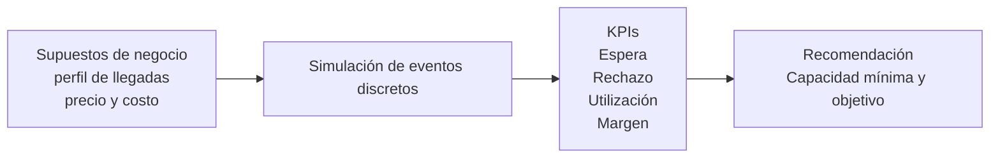

# Simulación de capacidad y colas

## Problema (3 líneas)
Una operación con demanda variable por hora necesita decidir cuántos cupos activos mantener para no colapsar la espera.
Si la capacidad es baja, sube el rechazo y se pierde ingreso; si es alta, crecen los costos fijos.
Este proyecto estima el punto operativo que balancea experiencia del cliente y margen.

## Solución (arquitectura en diagrama simple)


## Dataset y modelo (tablas + diccionario)
### Tabla de inputs
| Variable | Valor base |
|---|---:|
| Horas operativas | 12 |
| Perfil de llegadas por hora | `[10,13,18,22,26,24,23,20,18,16,14,11]` |
| Distribución de llegadas | Poisson por hora |
| Tiempo de servicio promedio | 22 min |
| Distribución de servicio | Exponencial |
| Cola máxima | 12 |
| Precio por servicio | USD 18 |
| Costo por cupo/hora | USD 11.5 |
| Escenarios | 2 a 12 cupos |

### Diccionario de datos (output)
| Campo | Descripción |
|---|---|
| `servers` | Cupos/servidores activos |
| `arrivals` | Llegadas totales simuladas |
| `served` | Clientes atendidos |
| `rejected` | Clientes rechazados por sistema lleno |
| `rejection_rate` | Tasa de rechazo |
| `avg_wait_minutes` | Espera promedio en minutos |
| `p90_wait_minutes` | Percentil 90 de espera |
| `utilization` | Utilización de capacidad |
| `revenue_usd` | Ingresos por servicios atendidos |
| `cost_usd` | Costo total de capacidad |
| `net_margin_usd` | Margen neto (ingreso - costo) |

## Resultados (KPIs + decisiones)
Resultado recomendado (escenario factible con espera <=10 min y rechazo <=5%):
- **Capacidad recomendada: 9 cupos**.
- Espera promedio estimada: **6.25 min**.
- Tasa de rechazo estimada: **0.88%**.
- Margen neto estimado: **USD 2,808**.

**Decisión concreta:** con **9 cupos y precio USD 18** se logra equilibrio entre servicio y rentabilidad; usarlo como baseline y recalibrar semanalmente.

## Cómo correrlo (pasos)
1. Ejecuta la simulación y generación de entregables:
   ```bash
   python src/run_analysis.py
   ```
2. Revisa resultados en:
   - `data/capacity_scenarios.csv`
   - `outputs/capacidad_vs_espera_vs_ingresos.svg`
   - `outputs/recomendacion.json`
   - `report/resumen_1_pagina.md`
3. Abre el notebook:
   - `notebooks/capacidad_colas.ipynb`


### Front-end visual (modo usuario)
También puedes usar una interfaz web simple para que cualquier usuario pruebe escenarios sin tocar código:

```bash
python src/webapp.py
```

Luego abre `http://localhost:8000` en tu navegador y ajusta parámetros (capacidad, precio, costos y objetivos de servicio).


## Demo (video corto o capturas)
### Capturas sugeridas
- Gráfico principal: `outputs/capacidad_vs_espera_vs_ingresos.svg`
- Tabla de escenarios: `data/capacity_scenarios.csv`
- Recomendación final: `outputs/recomendacion.json`

### Guion para video (60-90s)
1. **Esto entra:** supuestos (llegadas por hora, servicio, precio, costo).
2. **Esto procesa:** simulación de eventos discretos por escenario de cupos.
3. **Esto sale:** KPIs + recomendación operativa con impacto económico.
